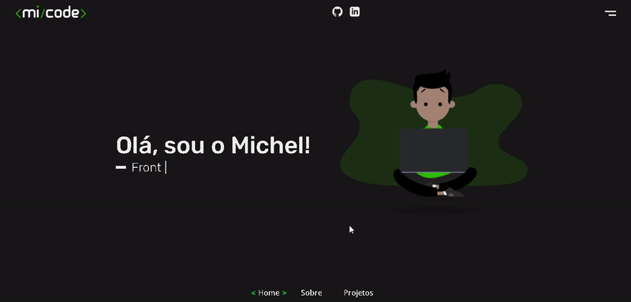

<p align="center">
  
</p>

<h1 align="center">
  📰 Meu Portfólio v2
</h1>

<p align="center">
  <a href="#-projeto">Projeto</a>&nbsp;&nbsp;&nbsp;|&nbsp;&nbsp;&nbsp;
  <a href="#-seções">Seções</a>&nbsp;&nbsp;&nbsp;|&nbsp;&nbsp;&nbsp;
  <a href="#-tecnologias-utilizadas">Tecnologias</a>&nbsp;&nbsp;&nbsp;|&nbsp;&nbsp;&nbsp;
  <a href="#%EF%B8%8F-executando-o-projeto">Executando o projeto</a>&nbsp;&nbsp;&nbsp;|&nbsp;&nbsp;&nbsp;
  <a href="#-desenvolvedor">Desenvolvedor</a>
</p>

<p align="center">
  
  
  
  
  
</p>

---

## 💻 Projeto
<p align="center">
  
</p>

<h4 align="center"><a href="https://mi-code.vercel.app/">Clique aqui para ver o projeto.</a></h4>

---

## 📌 Seções
Site composto por 3 seções:

- **Home:** Página inicial de apresentação;
- **Sobre:** Quem sou / Minhas hard skills;
- **Projetos:** Alguns projetos desenvolvidos com link direto para o build;

---

## 🚀 Tecnologias utilizadas
Esse projeto foi desenvolvido com a seguinte tecnologia e suas dependencias:

- Next.js
    - classnames
    - html-react-parser
    - sass
    - react-typed
    - styled-components

## ▶️ Executando o projeto

#### Clone o repositório usando o seguinte comando ou baixe

```
git clone https://github.com/micheldslive/micode-v2.git
```

#### Para instalar as dependências

```
yarn install
```

#### Para iniciar o servidor

```
yarn dev
```

O servidor estará disponível no http://localhost:3000 em seu navegador

---

## 💘 Desenvolvedor<br>
<table>
  <tr>
    <td align="center">
      <a href="https://github.com/micheldslive">
        <br>
        <sub>
          <b>Michel Domingos</b>
        </sub>
      </a>
    </td>
  </tr>
</table>
